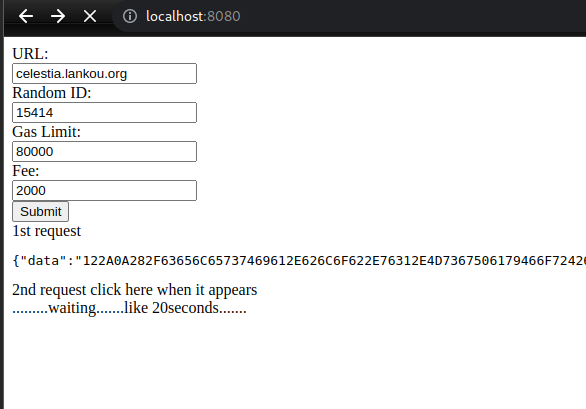

# celestia-pfb poster

written in go + jQuery

auto-everything and uses my light-node by default
- use my light node by default
- auto generate random id for namespace
- default gas limit
- default gas fee

launch:

    git clone https://github.com/thibault-ketterer/celestia-tools/
    cd pfb-generator

    go run webui-submit.go

just click 2 times and wait

there is also a cli version in cli-only dir
